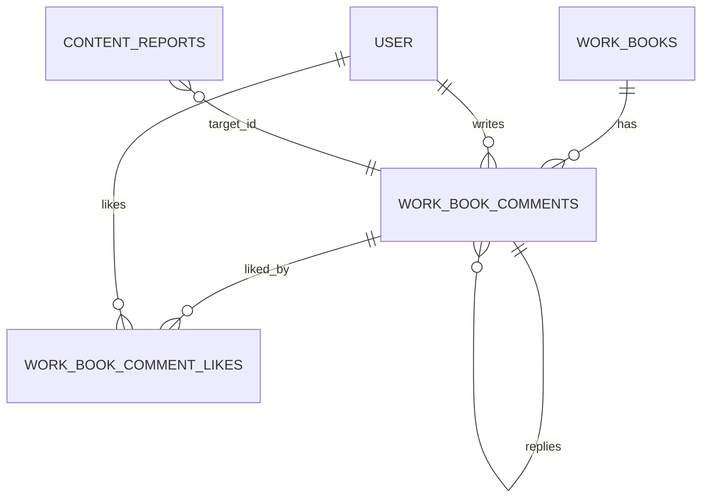
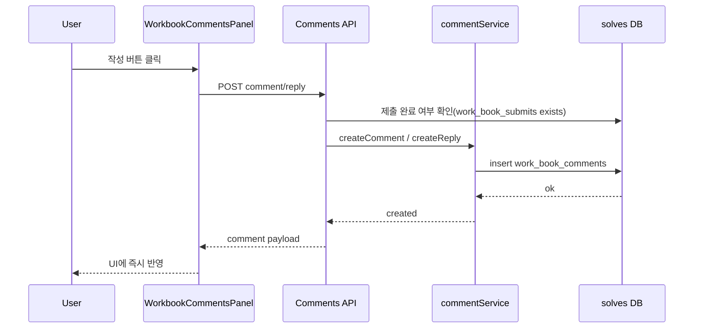
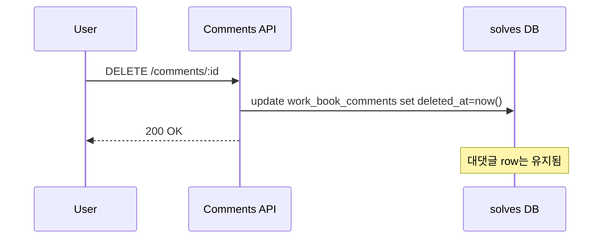

# Workbook Comments (v1) — Flow & Data Model

워크북 리뷰 화면에서 “풀이 댓글” 패널(`apps/solves/components/workbook/workbook-comments-panel.tsx`)을 실제 기능으로 만들기 위한 **서버/DB/신고/좋아요** 흐름 정리 문서입니다.

## Scope (v1)

- 워크북 기준 댓글
- **문제를 다 푼 사람(제출 완료)**만 댓글/대댓글/좋아요/신고/수정/삭제 가능
- 댓글 + **대댓글(1-depth)**만 지원 (대대댓글 X)
- 댓글/대댓글 **수정 가능**
- **소프트 삭제**
  - 부모 댓글이 삭제되어도 **대댓글은 유지**
  - 삭제된 댓글은 UI에서 “삭제된 댓글입니다” 같은 placeholder로 표현
- 댓글 수는 **루트+대댓글 포함 총 개수**
- 신고는 기존 `@service/report`를 재사용하되 **댓글 전용 사유**를 사용

## High-level Flow

```mermaid
flowchart TD
  UI[WorkbookCommentsPanel] -->|GET 댓글 목록| API[Comments API]
  UI -->|POST 댓글/대댓글| API
  UI -->|PATCH 댓글 수정| API
  UI -->|DELETE 댓글 삭제(soft)| API
  UI -->|POST 좋아요 토글| API
  UI -->|POST 신고| RAPI[Report API]

  API --> AUTH[권한 체크: 제출 완료 여부]
  AUTH --> SDB[(solves DB)]
  API --> SVC[commentService]
  SVC --> SDB

  RAPI --> RSVC[reportService]
  RSVC --> RDB[(report DB)]
```

## Permission Rule (중요)

“참여 가능”의 최소 조건:

- `solves.work_book_submits`에 **해당 `work_book_id` + `owner_id(userId)` 제출 기록이 존재**해야 함
  - `work_book_submits`는 `submitWorkBookSession()` 호출 시 생성되며 “제출 완료”로 취급 가능

권한 체크는 아래 액션에 공통 적용:

- 댓글 작성 / 대댓글 작성
- 댓글 수정 / 삭제
- 댓글 좋아요 토글
- 댓글 신고

## Data Model (추천)

### Table: `solves.work_book_comments`

댓글과 대댓글을 **단일 테이블**로 저장합니다.

| Column | Type | Null | Description |
|---|---:|:---:|---|
| `id` | uuid | N | 댓글 ID (PK) |
| `work_book_id` | uuid | N | 워크북 FK (`solves.work_books.id`) |
| `parent_id` | uuid | Y | 부모 댓글 ID (루트 댓글이면 NULL) |
| `author_id` | text | Y | 작성자 FK (`auth.user.id`), 탈퇴 시 set null 권장 |
| `body` | text | N | 댓글 본문 |
| `created_at` | timestamp | N | 생성 시각 |
| `edited_at` | timestamp | Y | 수정 시각 (수정됨 표시용) |
| `deleted_at` | timestamp | Y | 소프트 삭제 시각 |
| `deleted_reason` | text | Y | 운영/분쟁 대응용(선택) |

**FK / onDelete 정책(권장)**

- `work_book_id` → `work_books.id` : `onDelete cascade`
- `author_id` → `auth.user.id` : `onDelete set null`
- `parent_id` → `work_book_comments.id` : `onDelete set null`
  - 부모 댓글이 삭제/제거되어도 자식(대댓글) row는 유지 가능

**대대댓글 금지**

- DB 제약 대신 서비스 레벨에서 강제:
  - 대댓글 생성 시 `parent_id`가 가리키는 부모 댓글이 **루트 댓글인지(`parent.parent_id IS NULL`)** 검사

### Table: `solves.work_book_comment_likes`

| Column | Type | Null | Description |
|---|---:|:---:|---|
| `comment_id` | uuid | N | 댓글 FK (`solves.work_book_comments.id`) |
| `user_id` | text | N | 유저 FK (`auth.user.id`) |
| `created_at` | timestamp | Y | 좋아요 시각 |

**PK**

- `(comment_id, user_id)` (중복 좋아요 방지)

### Report Integration (기존 테이블 재사용)

신고 테이블은 신규 생성하지 않고 `report.content_reports`에 저장합니다.

- `target_type`에 댓글용 타입 추가 권장: `COMMENT` (길이 제한 10 이내)
- `target_id`에 `work_book_comments.id` 저장
- `category_detail`에 **댓글 전용 사유** enum 추가



## API (제안)

> 실제 경로는 프로젝트의 라우팅 구조에 맞춰 조정하면 됩니다. 아래는 UI/서비스에 맞춘 “의미 기반” 제안입니다.

### 1) 댓글 목록 조회

- `GET /workbooks/:workBookId/comments?cursor=&limit=`
- Response (예시)
  - `totalCount`: 루트+대댓글 포함 총 개수 (**삭제된 댓글은 제외**)
  - `comments`: 루트 댓글 배열
    - 각 루트 댓글에 `replies`(대댓글 배열)
    - 각 항목에 `isDeleted`/`body`/`editedAt`/`likeCount`/`isLikedByMe` 포함

### 2) 댓글 작성 (루트)

- `POST /workbooks/:workBookId/comments`
- Body: `{ body: string }`

### 3) 대댓글 작성 (1-depth)

- `POST /comments/:commentId/replies`
- Body: `{ body: string }`
- Server rule:
  - `commentId`(부모)이 루트 댓글인지 검사 (`parent_id IS NULL`)

### 4) 댓글 수정

- `PATCH /comments/:commentId`
- Body: `{ body: string }`
- Server rule:
  - 작성자 본인만 가능 (`author_id === session.user.id`)
  - `deleted_at IS NULL`인 경우만 허용(권장)
  - 성공 시 `edited_at = now()`

### 5) 댓글 삭제 (소프트 삭제)

- `DELETE /comments/:commentId`
- Server rule:
  - 작성자 본인(또는 관리자)만 가능
  - 실제 row 삭제 대신 `deleted_at = now()` 세팅
  - 대댓글은 그대로 유지

### 6) 좋아요 토글

- `POST /comments/:commentId/like`
- Response: `{ likeCount: number, isLiked: boolean }`
- 구현은 트랜잭션으로:
  - 있으면 delete → count - 1
  - 없으면 insert → count + 1

### 7) 신고(댓글 전용)

- `POST /comments/:commentId/report`
- Body: `{ categoryDetail: CommentReportReason, detailText?: string }`
- 저장: `report.content_reports`
  - `targetType = COMMENT`
  - `targetId = commentId`
  - `categoryMain = VIOLATION` (또는 COMMENT 전용 main을 새로 만들지 않고 현 체계에 매핑)

## Sequences

### 댓글/대댓글 작성



### 소프트 삭제(부모 삭제 후 대댓글 유지)



## Comment Report Reasons (예시)

> `report.category_detail`(length 25) 제한을 고려해 25자 이내로 작성합니다.

- `COMMENT_SPAM` (도배/스팸)
- `COMMENT_ABUSE` (욕설/괴롭힘)
- `COMMENT_HATE` (혐오표현)
- `COMMENT_SEXUAL` (성적/선정)
- `COMMENT_PERSONAL_DATA` (개인정보 노출)
- `COMMENT_COPYRIGHT` (저작권 침해)
- `COMMENT_OTHER` (기타)

## UI Mapping

`apps/solves/components/workbook/workbook-comments-panel.tsx` 기준 이벤트 매핑:

- “댓글 작성” → `POST /workbooks/:workBookId/comments`
- “답글 달기” → `POST /comments/:commentId/replies`
- “좋아요” → `POST /comments/:commentId/like`
- “신고” → `POST /comments/:commentId/report`
- “수정” (추가 예정 UI) → `PATCH /comments/:commentId`
- “삭제” (추가 예정 UI) → `DELETE /comments/:commentId`
